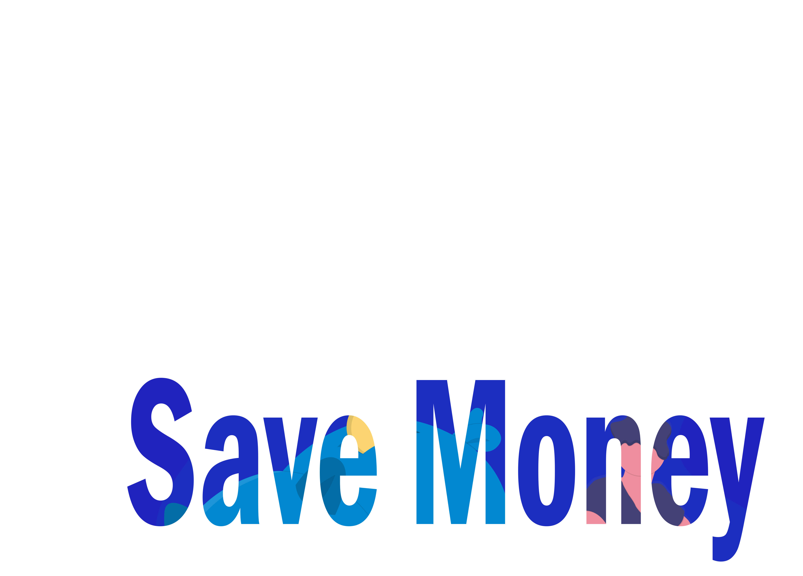

  
  www.savemoney.ml

# About the project

Save money is a personal expense control project online, showing the actual time spent, generating interactive 
graphs and table formatted PDFs. Its main objective is to facilitate the control of expenses, and it is not necessary 
to use extensive and complex notebooks or worksheets.

## About the Development

 Save Money was developed for learning purposes and greater mastery of the languages used in the development.
